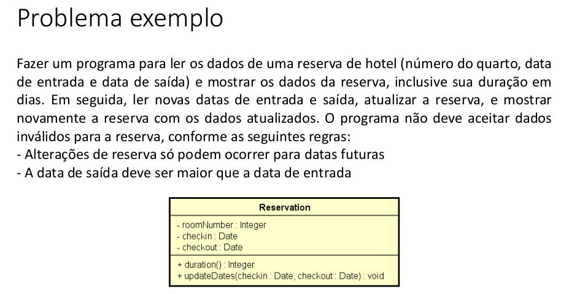
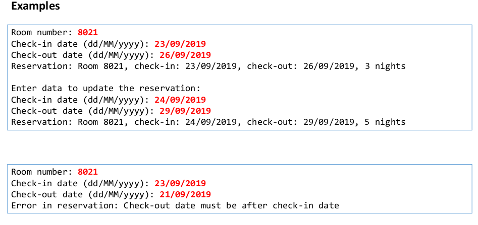
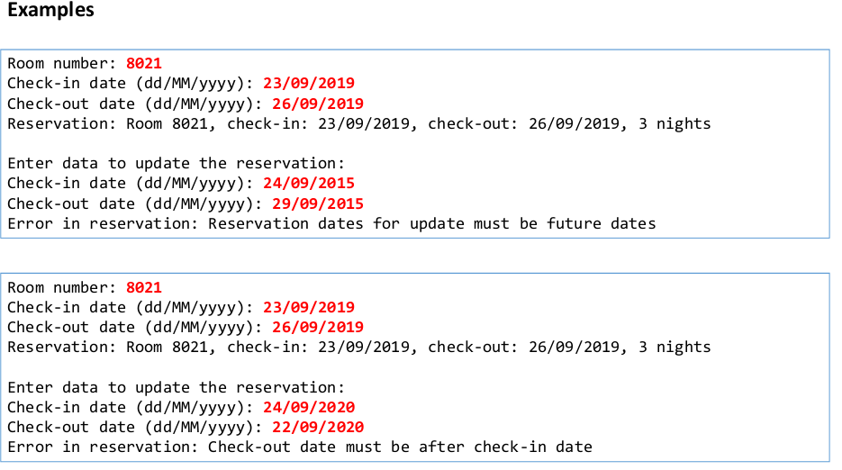

# Hotel  Reservation



> Trata-se de um mini projeto simples programado em **Java**, que visa criar exceções try-catch personalizadas, onde serão versionadas 3 soluções, sendo elas:

- [ ] Muito ruim - Lógica de validação no programa principal
- [x] Ruim - Método retornando string
- [ ] Boa - Tratamento de exceções

#### Obs: A caixa flegada acima, indicara o solução atual 




## 💻 Pré-requisitos

Antes de começar, verifique se você atendeu aos seguintes requisitos:
<!---Estes são apenas requisitos de exemplo. Adicionar, duplicar ou remover conforme necessário--->
* Você precisa compreender a linguagem Java e conceitos de POO (Encapsulamento, herança e polimorfismo)
* Você precisa compreender classes **Date, SimpleDateFormat** e o enum **TimeUnit**
* Você precisa compreender conceito de delegação
* Você precisa compreender try-catch e bloco finally

## Features
TimeUnit é um enum disponível no pacote **java.util.concurrent**, ele basicamente disponibiliza métodos para converter o tempo em unidades de tempo.

Neste projeto foi utilizado **TimeUnit** na classe **Reservation** para calcular a unidade de tempo em **dias** entre o ChekcIn e o CheckOut, conforme abaixo:

```Java
public long duration() {
    long diff = checkOut.getTime() - checkIn.getTime();
    
    return TimeUnit.DAYS.convert(diff, TimeUnit.MILLISECONDS);
}
```

<!--* Você leu `<guia / link / documentação_relacionada_ao_projeto>`.-->

### Ajustes e melhorias

O projeto ainda está em desenvolvimento e as próximas atualizações serão voltadas nas seguintes tarefas:

- [ ] Incluir banco de dados
- [ ] Incluir interface gráfica
## 🚀 Instalando <Order client>

Para instalar o <Order>, siga estas etapas:

Linux, macOS e Windows:
```
<git clone git@github.com:AlissonWenceslau/Hotelreservation.git >
```
###### Próximo passo
* Execute o projeto em uma IDE


[⬆ Voltar ao topo](#Hotelreservation)<br>